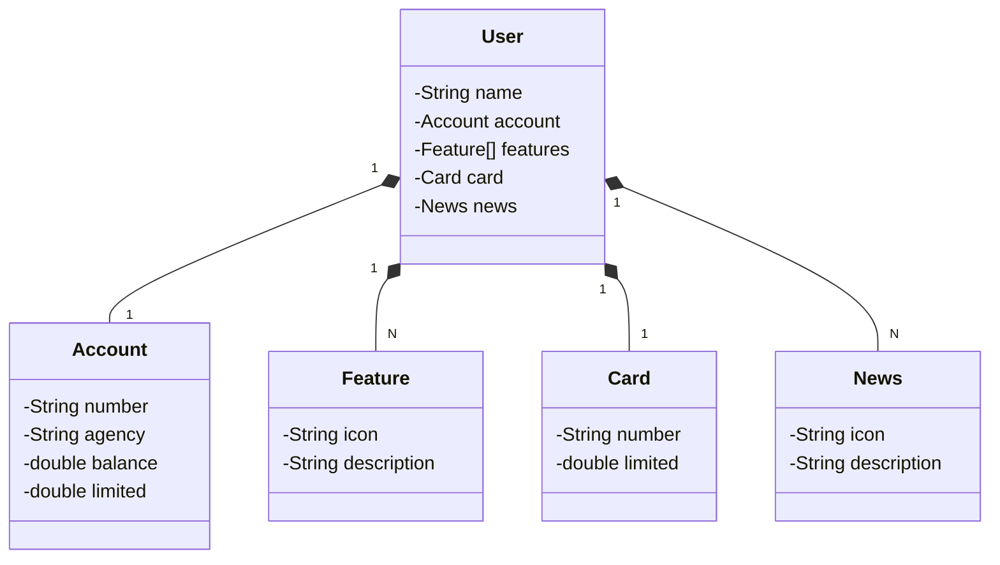

# Aplicação API Santander desenvolvido em Java (springboot), para aprimoramento de aprendizado.

Aplicação RESTfull gerada com padrões de desenvolvimento, alem de Debugging e testes de exceções realizados em IDE IntelliJ e VS Code.

# Olá, eu sou o Umberto! 👋

## Diagrama de classes utilizado no projeto (via Mermaid)

## Desenvolvido apartir de conhecimentos adquiridos em cursos, palestras e mentorias.

Atualmente estou ampliando estes pequenos projetos, que ocorrerão a medida que o aprendizado evoluir.

